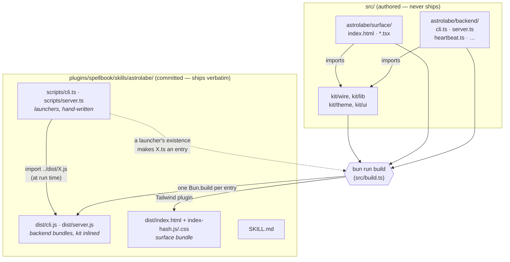
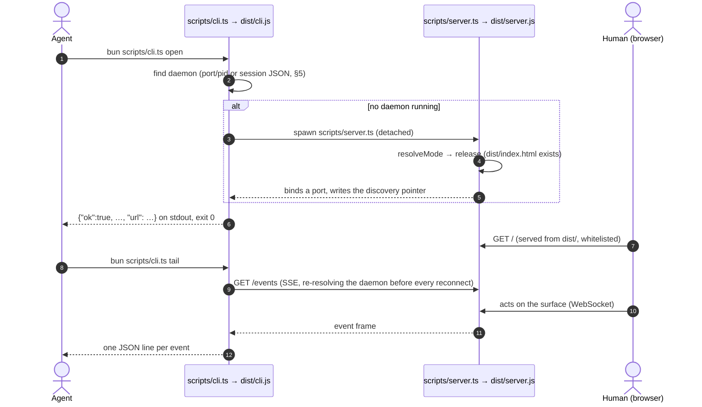

# Spell backends — how a spell is built, shipped and spawned

> **How to read this.** §1–§3 are the picture: what a spell is, where its files
> live, and the seam between the code you edit and the code that runs. If you
> read nothing else, read those three, and read §3's two diagrams. §4–§7 are
> reference: the shared spine, discovery, the contracts, and the instruments
> that hold them. §8 is the per-spell caveats table, which each port wrote at
> the moment it learned something.
>
> **This is the WHY, not the procedure.** To add a spell, follow
> [the scaffolding playbook](../playbooks/scaffolding-a-spell-playbook.md). To
> move an existing one onto the build, follow
> [the porting playbook](../playbooks/porting-a-spell-playbook.md). Those carry
> the steps and the gotchas. This document is here so the steps stop looking
> arbitrary.
>
> **Counts are as of `399ca241` (2026-09-10) and nothing maintains them.** Where
> a live number exists, §7 names the ward that prints it. Trust the ward's
> output over any number written here.

---

## Why this document exists

Cole, 2026-09-09, asked for an architecture doc explaining "how we build these
apps — the structure of the source directory, how the elements relate, and the
caveats we found in different apps."

The rulings and the defects were already recorded: the archived convergence's
[decision log](../projects/_archive/backend-convergence/decision-log.md)
(D1–D98), its phase journals, playbook Phase B, and three census investigations.
**What none of them capture is shape that is not a defect.** Digestify has one
entry and it is not called `cli`. Bounty's `join.ts` is a second participant,
not a helper. Grapevine names its daemon `daemon.ts`. Facts like those never
become decision-log entries, and within weeks you need archaeology to recover
them. That is what §8 is for, and §1–§7 are the frame that makes §8 readable.

## 1 · What a spell is

**A spell is a Claude Code skill that comes with a place for a human to look.**
It has two readers, and each gets its own half.

- **The agent half is a skill folder.** The agent reads `SKILL.md`, which tells
  it to run commands such as `bun <skill>/scripts/cli.ts open`. Each command
  answers in JSON — on stdout when it succeeds, as one envelope on stderr when
  it fails — and exits with a code the agent can route on (the error contract,
  §4 and §6). The agent never renders anything.
- **The human half is a surface:** a React page that a local daemon serves. The
  human opens the URL. The human never runs a CLI.

**The daemon joins the two halves.** The CLI spawns it on first need, detached
so that it outlives the CLI. After that both halves talk to the same process.
The surface loads over HTTP and then talks to the daemon over a WebSocket
(grapevine's surface uses an `EventSource` instead). The agent reaches it
through CLI verbs and through `tail`, a verb that holds an SSE connection open
and prints each event as a line. **The SSE stream is the agent's channel, not
the page's** — don't wire a new surface to `/events`. Whatever one side does
shows up on the board or in the stream the other side reads. That is the
co-presence model; this document covers its plumbing, not its product rules.

Not every spell has every piece. There are three shapes:

| shape                  | spells                            | what is different                                                                                                                          |
| ---------------------- | --------------------------------- | ------------------------------------------------------------------------------------------------------------------------------------------ |
| **standing daemon**    | astrolabe, grapevine, mind-mapper | one daemon per home directory, which stands until told to stop; the CLI finds it by a `port`/`pid` pair (§5)                               |
| **per-session daemon** | bounty, glamour, imago, magpie    | one daemon per session, several at once; the CLI finds it by a session JSON file (§5)                                                      |
| **single shot**        | digestify                         | one entry, `review`: it serves a page, blocks until the human is done, prints the result, and exits. No event log, no stream, no discovery |

Two exceptions sit outside the table. Bounty has a third caller-facing entry,
`join`, which is a WebSocket _participant_ the agent spawns directly. And
mind-mapper ships no `SKILL.md`: it is undeclared while it is in development, by
Cole's ruling (`47238d7`), so the roster listings correctly omit it.

### Why the two halves used to ship differently — and what is left of that

**The surface always needed a bundler.** TSX, React and Tailwind have to be
compiled, so the surface has been built into `dist/` from the start (seams
Contract 2).

**The backend did not.** Bun runs TypeScript directly, so each backend shipped
as source and ran straight out of the skill folder (Contract 3, original form).
That stopped being possible once backends began to **share code**. A skill must
install self-contained (Cole's ruling, recorded in Contract 3's 2026-09-04
amendment), so a backend that imports from `src/kit/` — which is outside its
deployed folder — has to be bundled, with the kit inlined. Today all eight
spells import the kit, so all eight build their backends.

What remains different is **how each half is reached**:

|                | the surface                                                    | the backend                                             |
| -------------- | -------------------------------------------------------------- | ------------------------------------------------------- |
| reached by     | **fetching**: the daemon serves files out of `dist/` over HTTP | **executing**: an agent runs a launcher at a fixed path |
| modes          | **two**: dev (compiled from `src/` on request) and release     | **one**: the launcher always runs `dist/`               |
| what may leave | only files the built `index.html` links (§4, `serveDist`)      | stdout, stderr and an exit code                         |

The backend's single mode is the most common trap in this repo, and §3 explains
it.

## 2 · The layout

There are two trees. **`src/` is authored input and never ships.**
**`plugins/spellbook/skills/<spell>/` is the deployed artifact.** The
marketplace copies the tracked plugin subtree verbatim, and there is no
packaging step, so whatever is tracked there ships (Contract 4).

```
src/
  build.ts                  # THE build: the only copy. Each spell's build.ts delegates here.
  kit/                      # shared code. A LEAF: imports nothing from outside src/kit/.
    wire/                   # what a caller can observe (§4): errors, tail, SSE, event log,
                            #   file serving, lifecycle, discovery, heartbeat
    lib/                    # the residual: cn, printJson
    theme/base.css          # surface design tokens (Contract 21)
    ui/                     # shared surface components
  <spell>/
    build.ts                # a two-line delegator to src/build.ts
    bunfig.toml             # wires the Tailwind plugin into dev serving
    backend/
      cli.ts                # an ENTRY, because scripts/cli.ts exists
      server.ts             # an ENTRY, because scripts/server.ts exists
      heartbeat.ts          # NOT an entry (no launcher): the spell's numbers, imported by both
      *.test.ts             #   entries so the CLI and daemon agree
    surface/
      index.html            # the surface entry
      main.tsx, App.tsx, …

plugins/spellbook/skills/<spell>/
  SKILL.md                  # what the agent reads
  scripts/
    cli.ts                  # LAUNCHER: 3–4 code lines, import { run } from "../dist/cli.js"
    server.ts               # LAUNCHER
  dist/                     # GENERATED *and* COMMITTED
    cli.js                  # backend bundle: kit inlined, inline sourcemap
    server.js               # backend bundle
    index.html              # surface entry, UNHASHED on purpose (§6, release mode)
    index-<hash>.js, .css   # surface chunks, content-hashed
  [shared/] [assets/] [acc.config.json] [tests/]    # optional; which spells have which: playbook N2
  [tsconfig.json] [references/]                    # also optional (astrolabe/glamour/magpie; imago)
```

Three rules make the tree what it is.

1. **An entry is a backend module that has a launcher.** `src/build.ts` builds
   `src/<spell>/backend/X.ts` if and only if `scripts/X.ts` exists (D43). There
   is no list anywhere; the set is read off the tree, which is why digestify's
   `review` and grapevine's `daemon` needed no special case. **The consequence
   you will hit:** a new entry without its launcher builds nothing, the build
   still exits 0, and **no check catches it** — a backend module with no
   launcher is indistinguishable, by design, from a helper module such as
   `reduce.ts`. Write the launcher first.
   `grimoire/launcher-pairing-ward.test.ts` checks the other two directions:
   every launcher has an emitted artifact, and every emitted backend artifact
   has a launcher.
2. **`dist/` is generated and committed.** It is committed because the
   marketplace ships only what is tracked. It is generated because it is a
   bundle. Contract 18 resolves the tension: a committed `dist/` is current if
   and only if a rebuild produces byte-identical files. That is why the build
   writes no stamp: a timestamp would make every rebuild differ from its
   committed self. `bun scripts/dist-check.ts` is the check, and it has two
   halves. The **presence** half (ARMs 0–1, `--no-build`) reads the tree and
   runs inside the gate as `dist-roster-ward`. The **reproduction** half (ARM 2)
   rebuilds every `dist/` in place and compares, which is only well-defined with
   no work in progress — so it is CI's job (Cole, 2026-09-01). Locally, run it
   only on a clean, committed tree. The build also makes exactly one `Bun.build`
   call per entry, never one call with several entries: a shared call hoists
   common code into a hashed chunk, so a change to one entry would rewrite the
   other entries' artifacts too.
3. **Nothing in the deployed folder imports out of it** — with one pinned
   exception. The kit reaches the deployed folder only by being inlined at build
   time (§3). The exception is each daemon's dev-only import of its surface
   source, which survives into the bundle and is never executed in release (§3).
   `grimoire/import-boundary-wards.test.ts` (ward 1a) checks the rule and holds
   those eight sites as a pinned exception list.

**Two known exceptions to "launchers only", both ruled.** Magpie's `scripts/`
holds `remove.py`, the Python sibling its daemon runs (D10, D13: it stays).
Astrolabe's holds `state.ts`, a two-sided module its surface also imports (D10),
plus `state.test.ts` and `cli.test.ts`, which D96 ruled stay because they test
shipped things. What remains open is only **which directory** those files belong
in — register row **D11**, which Cole chose to leave for now on 2026-09-10.

For the full generated/committed table and the `.gitignore` un-ignore list a new
spell must extend by hand, see
[playbook Phase N2](../playbooks/scaffolding-a-spell-playbook.md#phase-n2--the-layout--what-is-authored-what-is-generated-what-is-both).

## 3 · The seam

This is the section the earlier outline said needed a diagram, because prose
kept failing at it. The shape is counter-intuitive in three ways:

1. **A generated file is committed.** `dist/` is both output and source of truth
   for what ships (§2, rule 2).
2. **The file at the fixed path contains no logic.** `scripts/cli.ts` is the
   address that `SKILL.md` names, that the wards enumerate and that an installed
   caller types. The code lives in `dist/cli.js`. The launcher is a forwarder
   and must stay one: anything written in it ships unbuilt and untested.
3. **The kit crosses at build time, not at run time.** The deployed folder has
   no `src/kit/`. Each bundle carries its own inlined copy of the kit modules it
   uses. That is what makes "the kit is a leaf" a structural rule rather than a
   style preference. Whatever a kit module imports is inlined into every bundle
   that uses it. So a kit module that reached into a spell would carry that
   spell into seven others. And any change to a kit module, a widening included,
   lands in every artifact that bundles it. D68 counted that cost when it ruled
   against widening the kit to fit grapevine: six artifacts across five spells.

### Build time — what `bun run build` turns into what

Shown for astrolabe. Every spell has this shape; only the entry names differ.



Read the dotted edge carefully: **the launcher is an input to the build as well
as its consumer.** The build decides what to emit by looking for launchers, so
the launcher has to exist first.

### Run time — who spawns what, and who reads what

Shown for astrolabe, a standing daemon.



**How the other shapes differ.** A per-session spell (bounty, glamour, imago,
magpie) spawns a fresh daemon on every `open` rather than looking for one first,
and later verbs find it by the session pointer. Grapevine's `tail` reads a
per-channel route rather than `/events`. Digestify has no second process:
`review` is the server.

**Nothing at run time points into `src/`.** The one exception is the surface's
dev mode, covered below, and it sits behind a guard that release never takes.

### What runs where — and the traps that follow from it

**The backend has no dev mode. The launcher always runs `dist/`.** So which code
a check sees depends on how it reaches the code:

- **Unit tests** under `src/<spell>/backend/` import the source directly and see
  your edit immediately.
- **Process tests** — a spell's own cells that spawn the launcher — and the one
  grimoire ward that spawns (`error-choices-census`) run the **last build**.
- **The CLI-contract wards** (flag, strict-parse, terminator, exit-site) read
  backend **source** as text. **The artifact wards** (spawn-path,
  import-boundary, launcher-pairing) read `dist/` as text. Neither executes
  anything.

So after a source edit, some checks see the new code and some see the old, and
nothing tells you which. A mutation drive against a built entry is **silently
vacuous** without a rebuild (T23). `bun run gate` builds first for exactly this
reason. For an ad-hoc drive, run `bun run build <spell>` before it.

**Path arithmetic is true at one address only.** A daemon computes
`SKILL_ROOT = join(import.meta.dir, "..")`. From `dist/server.js`, `..` is the
skill folder, which is correct. From `src/<spell>/backend/server.ts`, `..` is
`src/<spell>/`, which is wrong, and every path derived from it points somewhere
else. Run from source in default mode, a daemon typically dies at its dev
surface import; with release forced, it looks for a `dist/` that isn't there.
The same holds for every path a bundle pins: the daemon launcher the CLI spawns,
magpie's Python sibling, digestify's `assets/`.
`grimoire/spawn-path-ward.test.ts` checks that each pin resolves **from the
emitted location**. Since C8 (D98) it also follows `DIST_DIR` into the kit's
resolvers. Directory pins remain its blind spot (register **C4**).

**The surface does have two modes, and a repo checkout runs release.** A daemon
serves release if and only if `dist/index.html` exists, and the env var
`SPELLBOOK_SURFACE_MODE=dev|release` overrides that (Contract 1). Because
`dist/` is committed, a checkout runs **release** by default too. Dev mode — Bun
compiling `src/<spell>/surface/` on request — has to be asked for. Two things
make dev mode work, and both fail invisibly in release:

- The daemon source contains a dev-only
  `await import("../../../../../src/<spell>/surface/index.html")`. The build
  passes `external: ["*/surface/index.html"]` so the bundler leaves it alone,
  and the specifier survives **byte for byte** into `dist/server.js`. It
  therefore resolves relative to `dist/`, **not** relative to the source file it
  is written in. Release never executes the line, so a wrong specifier is
  invisible until someone runs dev.
- The CLI must spawn a dev daemon with its cwd pinned to `src/<spell>/`, or
  `bunfig.toml`'s Tailwind plugin is not wired and the stylesheet fails
  (Contract 5; loudly — HTTP 500 — as measured on glamour).

**Three different defects produce the same symptom: the CLI reports that the
daemon failed to start.** The wording varies by spell — grapevine's is
`daemon failed to start within 3s`, astrolabe waits 45 s, mind-mapper says
`daemon did not come up within 10s`. The three causes are the wrong launcher
shape, the wrong spawn path, and a dev-mode surface import dying. To tell them
apart, run the daemon launcher on its own with no CLI involved. Grapevine's
`scripts/daemon.ts` header has the discrimination table, and playbook Gotcha 3
summarises it.

### The launcher's two shapes

Launchers differ in one line, and the choice depends on a single property:
**after `run()` resolves, must this process still be alive?** (D69;
[playbook N3](../playbooks/scaffolding-a-spell-playbook.md#phase-n3--the-launcher--and-why-its-path-is-the-contract)
has the table.)

- **Natural return** — `process.exitCode = await run();` — is used by all the
  CLIs, because an explicit `process.exit()` truncates a piped stdout at 64 KiB.
  Grapevine's daemon uses it too, because its `main()` returns once `Bun.serve`
  binds and the event loop keeps the process alive.
- **Terminal exit** — `const exitCode = await run(); process.exit(exitCode);` —
  is used by the six `server` daemons and by bounty's `join`, where something
  still holding the process open must not keep it alive.

The count is 9 natural-return and 7 terminal-exit. The name matches the shape in
14 of 16 cases. Choose from the property, not the name.

## 4 · The shared spine

`src/kit/` holds the code more than one spell uses. **It is a leaf**: nothing in
it imports from outside `src/kit/`, and ward 2 of the import-boundary wards
asserts that. That is what makes it safe to inline into any bundle (§3).

**`src/kit/wire/` is the part a caller can observe** (D7). Change anything in it
and an agent can see the difference, which is why the directory is named for the
cut. Each module's header is the authoritative account of what it fixes and of
what it deliberately left behind; read those headers, not this summary, before
you change one.

| module         | owns                                                                                                                                                                                                                        | adopted by                | the exceptions, and why                                                                                                                                       |
| -------------- | --------------------------------------------------------------------------------------------------------------------------------------------------------------------------------------------------------------------------- | ------------------------- | ------------------------------------------------------------------------------------------------------------------------------------------------------------- |
| `errors`       | the CLI failure contract: `kind` taxonomy, exit codes, the envelope, `die` (throws, never exits), `choices`                                                                                                                 | **8/8**                   | none. `kind` is the contract and `message` is presentation; a caller must never match on prose                                                                |
| `serveDist`    | release/dev resolution, content types, serving a file from `dist/` against a **whitelist** of names the built `index.html` links                                                                                            | **8/8**                   | the URL→filename mapping stays in each router (digestify substitutes into its HTML; grapevine serves at `/watch`)                                             |
| `housekeeping` | the idle-close decision, the sweep that makes it, bounded teardown (`drainAndStop`)                                                                                                                                         | **8/8**, split per export | digestify uses `shouldIdleClose` only; grapevine and mind-mapper use `drainAndStop` only — neither runs an idle sweep (D68; mind-mapper's `server.ts` header) |
| `tailEvents`   | the SSE tail **client** behind each spell's `tail` (and astrolabe's `join`; bounty's `join` is a WebSocket participant and does not use it); re-resolves the daemon before every connect; returns an exit code, never exits | 7/8                       | digestify has no stream                                                                                                                                       |
| `discovery`    | `writeFileAtomic` and `unlinkIfMatches`, the two primitives under both discovery conventions (§5)                                                                                                                           | 7/8                       | digestify has nothing to discover                                                                                                                             |
| `heartbeat`    | the derivations behind one invariant: the server's `idleTimeout` and the tail's watchdog must both exceed the SSE heartbeat; each spell's own `backend/heartbeat.ts` holds the numbers and **both halves import them**      | 7/8                       | digestify has no second half (its idle window is the caller's `--timeout`)                                                                                    |
| `eventLog`     | the bounded, replayable, append-only in-process log behind `GET /events`; optional `epoch`                                                                                                                                  | 6/8                       | grapevine: **REJECT-STRUCTURAL** — its log is N durable per-channel `.jsonl` files (D68); digestify: no log                                                   |
| `sse`          | the server side of the tail: the preamble, replay, heartbeat, a once-only teardown, `openFrames`                                                                                                                            | 6/8                       | grapevine: **REJECT-STRUCTURAL** — its subscribers carry metadata six routes read (D68); digestify: no stream                                                 |

**How a module got here, and how one does not.** Every `wire/` module was
converged toward the best of the copies the census found. Each adoption was
recorded as **GAINED**, **DE-DUPLICATED** or **RECEIVED** (a spell took on a fix
it did not have). Two verdicts exist for the cases that do not fit:

- **REJECT-STRUCTURAL** (D68): the subject exists but has a different shape.
  Widening the kit to fit is ruled out as the default repair, because a widening
  lands in every artifact that bundles the module.
- **LOSSY-COPY** (D79): the kit dropped a property its source had. Each such
  property is ruled on individually. A restoration into the kit is allowed only
  if it costs **zero source edits in other adopters and zero changed wire
  bytes**. Mind-mapper's port produced one RESTORE (`sse.openFrames`) and one
  KEEP-LOCAL (the required epoch).

**`src/kit/lib/`** is the residual: `cn` (class-name merging) and `printJson`
are shared, but they are not part of the observable wire (D7).
**`src/kit/theme/base.css` and `src/kit/ui/`** are the surface side. A spell
adopts the kit's styling by importing the stylesheet; importing a component
alone does not count (Contract 21, enforced by `kit-adoption-ward`) — and since
every surface opens `@import "tailwindcss" source(none)`, a spell that imports a
component WITHOUT the stylesheet renders it unstyled at HTTP 200 with a green
build, which `kit-styling-ward` now holds as its own cell. `src/kit/ui/` holds
`Dot` and `ConfirmDialog` (the confirm-or-cancel dialog, with a `useConfirm`
hook; scriptorium confirms a folder move with it). Both follow one rule: the kit
owns structure, behaviour and the five L0 neutrals, and the CALLER owns any
colour that carries meaning — a dot's fill, a confirm button's tone — because
those live in L1, where one spell's alias is another spell's brand.

## 5 · Two discovery conventions, deliberately

**How the CLI finds its daemon comes in two forms, and both are meant to exist**
(D3). They encode different models, and choosing one per spell is a product
decision rather than a factoring one.

| convention             | spells                            | the pointer                                                                | the model                                 |
| ---------------------- | --------------------------------- | -------------------------------------------------------------------------- | ----------------------------------------- |
| **per-session JSON**   | bounty, glamour, imago, magpie    | `$TMPDIR/<spell>-<session>.json`, plus `<spell>-latest.json`               | many concurrent sessions, a daemon each   |
| **singleton port/pid** | astrolabe, grapevine, mind-mapper | `$<SPELL>_HOME/daemon.port` + `daemon.pid` (home defaults to `~/.<spell>`) | one standing daemon per home              |
| none                   | digestify                         | —                                                                          | single shot; the process _is_ the session |

**What is shared is the primitives, not the conventions.**
`kit/wire/discovery.ts` supplies `writeFileAtomic`, which writes beside the
target and renames, so a reader never sees a half-written pointer (census defect
L3, fixed once for everyone), and `unlinkIfMatches`, which removes a pointer
only if it is still the one this daemon wrote.

**Why a restart doesn't strand a tail:** `tailEvents` takes the daemon's
location as a **callback**, called before every connect attempt, never as a
captured URL. Before that change astrolabe's `join` — meant to run for hours,
against a daemon that binds an ephemeral port — reconnected to a dead port
forever after any daemon restart. One callback shape covers every discovery
model: re-reading a session pointer, a pid-checked port file, or
respawn-if-absent.

A new spell picks one of the two conventions (playbook Phase N6). The test is
whether two sessions should ever run at once.

## 6 · The contracts, by consequence

The numbered contracts live in
[`.anthill/dev/seams.md`](../../.anthill/dev/seams.md), with their amendments
inline. The house rules with stable ids live in
[`grimoire/house-style.md`](../../grimoire/house-style.md). The contracts that
shape a spell's backend, stated by what they make you do:

- **Release mode is chosen by one file** (Contract 1). The daemon serves release
  if and only if `dist/index.html` exists. The **file**, not the directory: a
  `dist/` holding only `cli.js` must still resolve dev. So the surface entry
  must stay **unhashed** (Contract 2's amendment). A hashed `index-<hash>.html`
  would silently leave every daemon in dev mode.
- **The surface builds flat, hashed and dependency-free** (Contract 2). One
  `Bun.build`, the Tailwind plugin passed explicitly, React and Tailwind bundled
  into the chunks. `dist/` needs nothing installed at its destination.
- **A backend that shares code must build** (Contract 3, as amended 2026-09-04).
  The trigger is a criterion, not a list: an import that reaches outside the
  deployed skill folder. Source stays the default for a backend that shares
  nothing, and today no such backend exists.
- **The plugin subtree holds no source files** (Contract 4 and its amendment).
  Surface source lives in `src/`. Built backends carry an inline sourcemap, and
  that is allowed: "source-free" means no source **files** — nothing a consumer
  edits, nothing a resolver reads — not no source bytes. Contract 20 adds that
  you cannot prove this by grepping the artifact's text. The invariant lives in
  the folder's file list.
- **Dev mode needs the cwd pinned to `src/<spell>/`** (Contract 5), and routes
  bake at boot: a daemon change is not served until the daemon restarts.
- **A CLI failure is one JSON document on stderr, with stdout empty** (Contract
  15). `kind` maps to the exit code (`usage` 2, `internal` 1, `not_found` 5,
  `conflict` 6), and a caller routes on `kind`, never on the message. A
  rejection with a closed set of valid answers names them in `choices`. The flag
  registry and the verb→flags spec each have one source, and the parser, help,
  rejections and the drift wards all read from it. `kit/wire/errors.ts` is the
  implementation.
- **The shipped artifact is checked by rebuilding it** (Contract 18). Two
  requirements, per its 2026-09-01 amendment: the pathspec must be **literal**
  (a globbed pathspec matched nothing and reported green on a stale tree), and
  the comparison must be `git status --porcelain`, because `git diff` is blind
  to a purely additive change such as a new untracked chunk. A check that
  examined zero files is **no verdict**, not a pass. Reproduction is only
  defined on a tree with no work in progress, which is why it runs in CI.
- **A check's population follows its subject** (Contract 19). When code moves,
  the check's population is the half that silently stops covering it. The
  contract records four cases where a relocation left a check green because it
  had stopped looking.
- **A spell adopts kit styling by importing the kit's stylesheet**, and its
  Tailwind content scan is scoped to its own surface (Contract 21).

## 7 · The instruments

`bun run gate` is `build && check && test`. The build is a bundler and
type-checks nothing. `check` is biome, which includes `noUndeclaredVariables`
with `Bun` declared as a global. `test` is `bun test`, and it runs every
grimoire ward. **Run the gate unpiped** and read its exit code from a file:
`bun run gate | tail` reports `tail`'s exit code, which is always 0. **Type
errors block the gate** (Cole, 2026-09-10, once the repo reached zero —
type-debt T37), through `type-check-ward` rather than a bare `tsc`: see below
and [the type-debt project](../projects/_archive/type-debt/proposal.md).

| guards                   | instrument                                                                                | what it holds                                                                                                                                                  |
| ------------------------ | ----------------------------------------------------------------------------------------- | -------------------------------------------------------------------------------------------------------------------------------------------------------------- |
| the artifact             | `scripts/dist-check.ts`                                                                   | Contract 18: the committed `dist/` reproduces byte for byte. Not in the gate: it rebuilds in place, so it is CI's (§2)                                         |
|                          | `dist-roster-ward`                                                                        | every spell's `dist/` is un-ignored, so it doesn't silently ship absent                                                                                        |
|                          | `launcher-pairing-ward`                                                                   | backend entry ⇄ launcher, both directions; prints the per-spell `surface=[…] backend=[…]` census                                                               |
|                          | `spawn-path-ward`                                                                         | every path a bundle pins resolves from the **emitted** location, including through kit resolvers (C8)                                                          |
| the boundaries           | `import-boundary-wards`                                                                   | nothing in the plugin subtree resolves outside it; the kit imports nothing outside itself                                                                      |
|                          | `kit-adoption-ward`, `kit-prose-ward`, `kit-styling-ward`, `spell-css-scope-ward`         | the surface-side kit rules (Contract 21), including Tailwind's habit of scanning comments as classes                                                           |
| the CLI contract         | `exit-site-inventory`, `terminator-invariant`, `strict-parse-invariant`, `flag-invariant` | how each entry ends; that unknown flags refuse; that free text never becomes a flag; that `SKILL.md` flags exist                                               |
|                          | `error-choices-census`                                                                    | a rejection that has a closed set of valid answers in hand names it in `choices` (register A1)                                                                 |
| the daemon               | `daemon-lifecycle-ward`                                                                   | an exact-equality census of lifecycle clauses, per spell (C11)                                                                                                 |
| the roster and the canon | `roster-drift`, `rule-id`, `gate-honesty`                                                 | every shipped spell is declared; every house rule is addressable; the gate states what it cannot read                                                          |
| types                    | `type-check-ward` (with `scripts/instruments/type-debt-census.ts`)                        | zero `tsc --noEmit` errors, each `src/<spell>/tsconfig.json` workspace under its own config, and every file examined — an unexamined area is red, never a zero |
| agent conformance        | `acc` per skill (`acc.config.json`)                                                       | the CLI's declared surface; **run it from the skill directory** — its config discovery is cwd-based                                                            |

### The rule the instruments taught

Several instrument defects in this project had one shape. D42 states the rule
under three of them:

> **A subject an instrument names and does not examine must produce a row saying
> "not looked at". The absence of a finding must never be spelled the same way
> as the absence of a subject.**

Three related rules sit beside it, each of which paid for itself:

- **Never compute a gate from the predicate it backstops** (D36). The spawn-path
  ward decides whether to assert `dist/index.html` from the **source** tree
  (`hasSurface`), because asking whether the file exists would assert that it
  exists if it exists.
- **A derived population is not coverage.** A population read from the index is
  not one read from the tree, and a ward's population must follow its subject
  when the subject moves (Contract 19).
- **A count that goes down is not a failure, so nothing reports it** (C4, D64).
  That is why the newer wards use exact equality rather than floors. The
  trade-off: a new spell has to edit the pinned numbers, and each ward says so
  when it fails.

The register rows **C4, C8, C10 and C11** are four levels of one defect: an
instrument that could not say what it hadn't examined. **Three are closed.** C8
made the spawn-path ward follow the anchor into the kit. C10 made each coverage
row name which absence it is. C11 turned the lifecycle ward's floors into a
per-clause census. **C4 is still open, though C8 narrowed it:** a pin that
points at a **directory**, such as digestify's `assets/`, sits between the
spawn-path ward's cells. A broken directory pin ships green through everything;
that has been driven, not merely reasoned about. See
[the register](./house-conformance-register.md).

## 8 · Per-spell caveats — APPEND WHEN YOU LEARN SOMETHING

One row per spell. Shape, not defects — defects go to `decision-log.md`, live
inconsistencies go to
[the house conformance register](./house-conformance-register.md).

| spell           | entries                     | shape worth knowing                                                                                                                                                                                                                                                                                                                                                                                                                                                                                                                                                                                                                                                                                                                                                                                                                                                                                                                                                                                                                                                                                                                                                                                                                                                                                                                                                                                                                                                                                                                                                                                                                                                                                                                                                                                                                                                                                                                                                                                                                                                                                                                                                                                                                                                                                                                                                                                                                                                                                                                                                                                                                                                                                                                                                                                                                                                                                                                                                                                                                                                                                                                                                                                                                                                                                                                                                                                                                                                                                                                                                                                                                                                                                                                                                                                                                                                                                                                                                                                                                                                                                                                                                                                                                   |
| --------------- | --------------------------- | ------------------------------------------------------------------------------------------------------------------------------------------------------------------------------------------------------------------------------------------------------------------------------------------------------------------------------------------------------------------------------------------------------------------------------------------------------------------------------------------------------------------------------------------------------------------------------------------------------------------------------------------------------------------------------------------------------------------------------------------------------------------------------------------------------------------------------------------------------------------------------------------------------------------------------------------------------------------------------------------------------------------------------------------------------------------------------------------------------------------------------------------------------------------------------------------------------------------------------------------------------------------------------------------------------------------------------------------------------------------------------------------------------------------------------------------------------------------------------------------------------------------------------------------------------------------------------------------------------------------------------------------------------------------------------------------------------------------------------------------------------------------------------------------------------------------------------------------------------------------------------------------------------------------------------------------------------------------------------------------------------------------------------------------------------------------------------------------------------------------------------------------------------------------------------------------------------------------------------------------------------------------------------------------------------------------------------------------------------------------------------------------------------------------------------------------------------------------------------------------------------------------------------------------------------------------------------------------------------------------------------------------------------------------------------------------------------------------------------------------------------------------------------------------------------------------------------------------------------------------------------------------------------------------------------------------------------------------------------------------------------------------------------------------------------------------------------------------------------------------------------------------------------------------------------------------------------------------------------------------------------------------------------------------------------------------------------------------------------------------------------------------------------------------------------------------------------------------------------------------------------------------------------------------------------------------------------------------------------------------------------------------------------------------------------------------------------------------------------------------------------------------------------------------------------------------------------------------------------------------------------------------------------------------------------------------------------------------------------------------------------------------------------------------------------------------------------------------------------------------------------------------------------------------------------------------------------------------------------------- |
| **astrolabe**   | `cli`, `server`             | Singleton daemon per `$ASTROLABE_HOME`; binds an ephemeral port, so a tail that captured a URL cannot survive a restart (B1). Its event log stamps an epoch; four other daemons do not.                                                                                                                                                                                                                                                                                                                                                                                                                                                                                                                                                                                                                                                                                                                                                                                                                                                                                                                                                                                                                                                                                                                                                                                                                                                                                                                                                                                                                                                                                                                                                                                                                                                                                                                                                                                                                                                                                                                                                                                                                                                                                                                                                                                                                                                                                                                                                                                                                                                                                                                                                                                                                                                                                                                                                                                                                                                                                                                                                                                                                                                                                                                                                                                                                                                                                                                                                                                                                                                                                                                                                                                                                                                                                                                                                                                                                                                                                                                                                                                                                                               |
| **magpie**      | `cli`, `server`             | Ships a **Python** runtime sibling (`remove.py`) resolved from the emitted location — the first non-TS pinned path, and the defect class that produced the spawn-path ward. Daemon heartbeats on the kit default (15,000 ms) with no env override.                                                                                                                                                                                                                                                                                                                                                                                                                                                                                                                                                                                                                                                                                                                                                                                                                                                                                                                                                                                                                                                                                                                                                                                                                                                                                                                                                                                                                                                                                                                                                                                                                                                                                                                                                                                                                                                                                                                                                                                                                                                                                                                                                                                                                                                                                                                                                                                                                                                                                                                                                                                                                                                                                                                                                                                                                                                                                                                                                                                                                                                                                                                                                                                                                                                                                                                                                                                                                                                                                                                                                                                                                                                                                                                                                                                                                                                                                                                                                                                    |
| **glamour**     | `cli`, `server`             | A fork of the imago line, so the pattern transfers. Its `shared/` is imported by the surface and stays in the skill folder. Only spell with an `acc.config.json` among the ported set at port time (CONFORMANT L0, and the port had to preserve it).                                                                                                                                                                                                                                                                                                                                                                                                                                                                                                                                                                                                                                                                                                                                                                                                                                                                                                                                                                                                                                                                                                                                                                                                                                                                                                                                                                                                                                                                                                                                                                                                                                                                                                                                                                                                                                                                                                                                                                                                                                                                                                                                                                                                                                                                                                                                                                                                                                                                                                                                                                                                                                                                                                                                                                                                                                                                                                                                                                                                                                                                                                                                                                                                                                                                                                                                                                                                                                                                                                                                                                                                                                                                                                                                                                                                                                                                                                                                                                                  |
| **imago**       | `cli`, `server`             | Daemon is 1,765 lines — larger than glamour's whole backend. Surface reaches into the skill folder **33 times**. Emits payload-bearing event types, which is how a payload `id` came to collide with the tail cursor. No acc config.                                                                                                                                                                                                                                                                                                                                                                                                                                                                                                                                                                                                                                                                                                                                                                                                                                                                                                                                                                                                                                                                                                                                                                                                                                                                                                                                                                                                                                                                                                                                                                                                                                                                                                                                                                                                                                                                                                                                                                                                                                                                                                                                                                                                                                                                                                                                                                                                                                                                                                                                                                                                                                                                                                                                                                                                                                                                                                                                                                                                                                                                                                                                                                                                                                                                                                                                                                                                                                                                                                                                                                                                                                                                                                                                                                                                                                                                                                                                                                                                  |
| **bounty**      | `cli`, `server`, **`join`** | **Three** caller-facing entries; `join.ts` is a WebSocket _participant_ an agent spawns directly, not a helper — daemon-shaped, its exit terminates a live socket. Serves `assets/` (favicon, wordmark, two mascots, a README) from the skill folder. Where half the spine was copied FROM, so adoption ran backwards in places.                                                                                                                                                                                                                                                                                                                                                                                                                                                                                                                                                                                                                                                                                                                                                                                                                                                                                                                                                                                                                                                                                                                                                                                                                                                                                                                                                                                                                                                                                                                                                                                                                                                                                                                                                                                                                                                                                                                                                                                                                                                                                                                                                                                                                                                                                                                                                                                                                                                                                                                                                                                                                                                                                                                                                                                                                                                                                                                                                                                                                                                                                                                                                                                                                                                                                                                                                                                                                                                                                                                                                                                                                                                                                                                                                                                                                                                                                                      |
| **digestify**   | **`review` only**           | **Ported 2026-09-09 (Phase 5).** One entry, not called `cli`, and **CLI-shaped by stdout while carrying a DAEMON's arithmetic** (`SKILL_ROOT = join(SCRIPT_DIR, "..")`) — independent properties the playbook used to assume were one; the artifact is the only address that arithmetic is true at, so it keeps no `import.meta.main`, and run from the wrong anchor its diagnostics **lie confidently** rather than going quiet (D57). Single-shot: **no event log, no SSE, no discovery pointer, no second client** — **four of the kit's eight wire modules have no subject** (`eventLog`, `sse`, `tailEvents`, `discovery`), `startHousekeeping` and `drainAndStop` have none either, and **the epoch ruling is N/A** (no log to stamp, so L6 is neither closed nor narrowed). **No second half**, so B8's `heartbeat.ts` seam is N/A and was not manufactured; the idle window is `--timeout`, the caller's own number, slid forward by a beat whose gap is expressed once in the SURFACE (`timer.ts`) — **a chained pair whose seam is backend↔surface, which no kit module carries.** Serves `/` as the built HTML **substituted in memory** and serves the rest of `dist/` from a **WHITELIST of the names the built `index.html` links** — which is `serveFromDist`'s defence now, for all six adopters, since the identical leak was measured at the other five and the whitelist moved into the kit (D65, `0260c725`). What stays at this call site is the ONE line digestify does not share: the kit's set INCLUDES `index.html` because for every other spell that IS the surface, and this spell must never hand over its unsubstituted entry (D66). ⚠ **It was a by-name refusal until the repair chapter, and the refusal-by-name is what failed:** a blacklist refuses the file it was told about and serves every neighbour, so `GET /review.js` handed out the 122,389-byte BACKEND BUNDLE this port had just moved into `dist/` (200, `text/javascript`, byte-identical to the artifact), and `/INDEX.HTML`, `/Index.html`, `/index.HTML`, `/iNdEx.HtMl` all missed a case-sensitive `===` on a case-INSENSITIVE filesystem and served the unsubstituted document at 200. The whitelist is an exact match against emitted names, so the refusal is case-insensitive by construction (D61). Its failures had **no `die`, no class, no envelope** — eight `stderr` prose + `return 2` sites, all converted; **124 / 130 stay OUTSIDE the taxonomy as session outcomes**, and `5`/`6` are new (D58). Zero rows in `exit-site-inventory` and `terminator-invariant`, and that is correct — it has no `process.exit` at all. No acc config. ⚠ Its `assets/` pin is a **directory**, so `spawn-path-ward`'s resolve cell drops it (it requires an extension) and the escape cell does not reach it (it is inside the plugin root) — driven by hand, filed in the register.                                                                                                                                                                                                                                                                                                                                                                                                                                                                                                                                                                                                                                                                                                                                                                                                                                                                                                                                                                                                                                                                                                                                                                                                                                                                                                                                              |
| **grapevine**   | `cli`, **`daemon`**         | **Ported 2026-09-09 (Phase 6).** Names its daemon `daemon.ts`. **Its `main()` RETURNS WHILE THE PROCESS MUST KEEP LIVING** — it resolves as soon as `Bun.serve` binds, and the event loop, not the promise, holds the daemon up; its exit codes live at in-body `process.exit` calls and in `shutdown()`, never in `main`'s return. So it takes the **natural-return launcher**, and the terminal-exit shape kills it milliseconds after it binds (driven; **D69**). ⚠ **Three separate defect classes report the same sentence here** — `daemon failed to start within 3s`: that launcher shape, the flat sibling spawn `DAEMON_SCRIPT = join(SCRIPT_DIR, "daemon.ts")` (glamour's B4 shape, which grapevine also has), and a dev-mode surface import dying, which is what `cli.ts`'s own comment attributes it to. **Its event bus cannot be served by the shared spine, and the reason is a SHAPE rather than an absence** — the first **REJECT-STRUCTURAL** rows in the roster (**D68**): `eventLog` is one in-memory array capped at 1000 against grapevine's **N durable per-channel `.jsonl` files** each with its own `next_id`, replayed off disk; `sse`'s `Set<{close,send}>` cannot hold `Map<symbol,{alias,human,lurk,send}>`, whose metadata **six routes** read. Neither is NO SUBJECT — both subjects exist and are the busiest things in the spell — and **the kit was NOT widened**, because a widening lands in every spell that bundles the module: six artifacts across five spells for these rows. `housekeeping` SPLITS: `shouldIdleClose` + `startHousekeeping` have **no subject** (singleton, no idle sweep, no snapshot, no `--timeout`), while `drainAndStop`'s stop-race IS its `Promise.race([server.stop(true), 200ms])` with **no expressible `clients`** — its subscriber records carry `send` and no `close`. **Ids are DURABLE, so it stamps NO epoch and L6 does not arise** (**D70**): `loadChannel()` derives `next_id` as a high-water mark over the channel log, so ids ascend across restarts — and stamping one would make `tailEvents`'s `onEpochChange` (`cursor = 0`) replay **every message of every tailed channel into every tail's stdout on every `roll`**. **Nothing is substituted** — `/watch` serves the committed `dist/index.html` verbatim and `/` is a JSON status route — so it has **no by-name refusal to keep**; its local `serveDist` is the pre-whitelist kit function verbatim, which makes `serveFromDist` a **RECEIVED** row that gains it the whitelist (D65) before the port puts `daemon.js` and `cli.js` into the directory it serves. Question 3 answers YES, so B8's `heartbeat.ts` seam is real here — the first spell in three ports for which it is not N/A; the daemon beats on a literal `3000` against `idleTimeout: 255`. Holds the roster's ONE `src/`-naming specifier (a dev-only dynamic import, five `..`, pinned by `import-boundary-wards`) — the pin now sits at `dist/daemon.js`, where the `--external` specifier actually executes. No acc config. **What the port added to this row:** the leak was MEASURED before it was closed (`GET /daemon.js` → 200 / 146,330 bytes, `GET /cli.js` → 200 / 251,310, both 404 after adopting `serveFromDist`); the error contract was **two** contracts, not one — 46 `die` sites PLUS four parser rejections writing their own prose and returning 2, and **that prose was a machine surface** (flag-set extractor markers, sorted long-flags-first), so the enumerations moved into `choices` rather than being replaced (D71); `not_found` **5** and `conflict` **6** are new at 38 raise sites and SKILL.md publishes the table (D72); `drainAndStop` is called with an empty `clients` and `graceMs: 0`, both measured (D73); and `tailEvents`'s returned exit code needed a seam through the command REGISTRY, whose `run` is typed `unknown` so it can cross (D74). Its CLI now has **zero live `process.exit` sites**, the sixth to reach that. The tail had **no idle watchdog at all** before the adoption; it is now `tailIdleMs(3000)` = 9,000 ms — a fifth of every sibling's, because grapevine beats five times as fast, which is the sharpest instance of "derive it, never copy it". |
| **mind-mapper** | `cli`, `server`             | **Ported 2026-09-09 (Phase 7) — the LAST port, and the only one where the kit was the SOURCE.** `sse.ts:9` and `eventLog.ts:7` both name this spell as their convergence target and it had adopted neither: the spine was proven on astrolabe and magpie (D1, D17), its two downstream FORKS, so the boundaries were settled against two copies while the original was not in the room. **A convergence can name its source and still never consult it.** Two properties came back as **LOSSY-COPY** (D79) and they did NOT go the same way — `sse` could not write a frame BEFORE the replay, which is a POSITION and occupies no type, so it was **RESTORED** to the kit as `openFrames` on two driven numbers (zero source edits, zero wire bytes at the other five; D85); and the mandatory epoch is **KEEP-LOCAL**, kept by one argument at one construction site with kit bytes ZERO, because making the kit's `epoch` required would reverse D39/D48/D70. Census **L6 stays closed here and open, by opt-out, for three others.** **The largest port: 55 files / 16,306 lines, of which 32 files / 9,072 lines are tests** — more than all six earlier ports combined, so B6's "split the constant" advice became a triage TABLE and then a shared module (`backend/paths.ts`: one repo-root marker walk, three named addresses, one derived dev cwd). ⛔ **THE DAEMON IS A LIBRARY WITH AN ENTRY POINT** (`export { main, readDoc, sseResponse }`, imported in-process by `sse-keepalive.test.ts`), so a test can relate to an entry three ways — spawn (→ launcher), source-scan (→ source) and SYMBOL IMPORT (→ source) — and `cli-contract.test.ts` had ONE constant doing two of them, spelled `new URL("./cli.ts", import.meta.url).pathname`, which no `SCRIPT_DIR` or `join(` grep finds. Its surface imports **zero** backend modules, so everything moved and **no `shared/` survives — the first spell to end B1 with an empty shared set.** **The only spell with no `SKILL.md`, and that is Cole's ruling (`47238d7`), not debt** — the entry set is derived from `scripts/` alone, the exit-code table has no published home, and 39 caller-facing flags stay unwarded because `flag-invariant`'s per-spell cell returns before either arm runs. **The port does not write one** (D80). ⚠ Left OPEN by that ruling and now concrete: whether the built artifact belongs in the published package while the spell is WIP. `tail.test.ts` was ruled the port's ORACLE rather than re-pointed (there is no import to re-point) — green either side, 4 cells / 16 assertions, 1,249 ms → 1,250 ms — ⛔ **with one recorded fixture edit, because its fake server is a WRITER of the wire and D81 priced the rename by counting READERS** (D86). It also caught a `ReferenceError` that `biome` passes and `bun run build` exits 0 over. Adopting `eventLog` renamed `seq` → `id` (**FORCED**) across 173 surface occurrences and ~209 backend ones plus every JSONL line the tail writes into an agent's pipe; **the flatten is the house idiom all five earlier adopters follow and was DECLINED** — `Frame<T>` is generic. Two smaller wire deltas came with it: the SSE keepalive comment is now `: hb` (was `: keepalive`) and `.html` carries `charset=utf-8`. `housekeeping`'s idle sweep and snapshot have **NO SUBJECT** (`server.ts:1685` — "no idle timeout in V1"), so census **L1** has none either; `drainAndStop` DE-DUPLICATES with `graceMs: 0` and no `clients`/`sockets`, three blanks that are measurements. CLI has zero exit sites and already threw a `CliError` with the kit's exact taxonomy, so B9's cost was pre-paid — **60 raise sites, of which a `die(` grep finds ONE and it is prose** — and its four bare `catch {}` warning-parsers each sit within seven lines of a die-reachable `passOrThrow`, every one in a function that ends by printing a receipt. The one `E-terminal` row is `server.ts`'s and did NOT move: the launcher is the process entry now.                                                                                                                                                                                                                      |

## Version history

- **2026-09-10** — Prose written for §1–§7, including the two §3 diagrams (build
  time and run time) that the outline called for. The outline, the "unassigned"
  banner and the "what the prose still needs" section were retired; their job is
  done. The magpie row was corrected: its heartbeat now comes from the kit
  default rather than a literal. Contract citations now point to
  `.anthill/dev/seams.md`, where the numbered contracts live.
- **2026-09-09** — Created during the backend convergence as an outline plus the
  per-spell caveats table, filled in one row per port. The table was completed
  (8/8) at mind-mapper's port.
